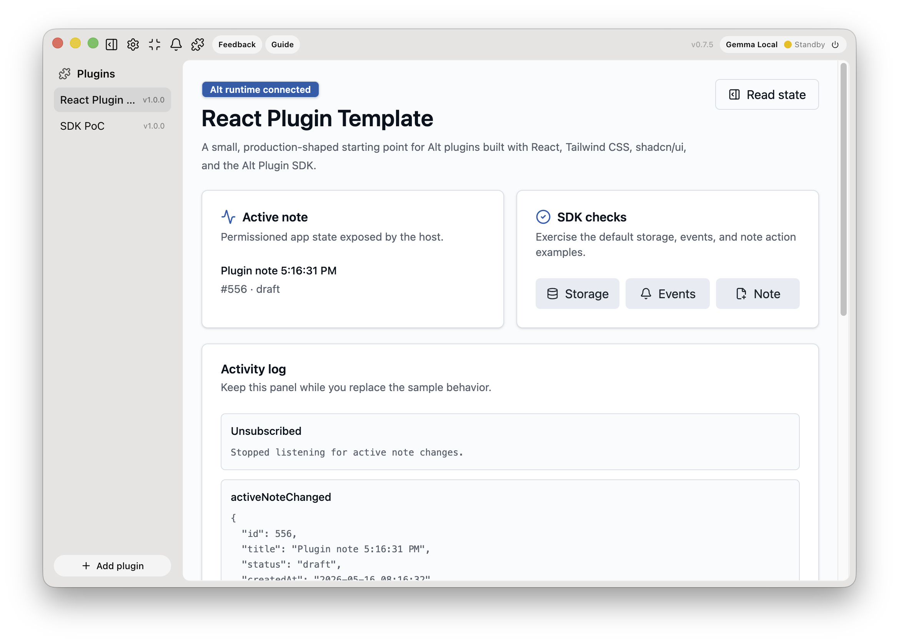

# Alt React Plugin Template

A clean starter for building local Alt plugins with React, Vite+, Tailwind CSS, shadcn/ui-style components, and `@alt/plugin-sdk`.



Plugins built from this template compile to static files and run inside Alt's sandboxed plugin view. They should never import Electron, Node APIs, filesystem APIs, secrets, or direct network clients. Use the Alt Plugin SDK for every host interaction.

## Stack

- Vite+ project workflow (`vp dev`, `vp check`, `vp build`)
- Vite React TypeScript app
- Tailwind CSS v4 with `@tailwindcss/vite`
- shadcn/ui-style local components
- `@alt/plugin-sdk` for manifest typing and runtime SDK calls
- Static `manifest.json` copied into `dist/` during build

## Requirements

- Node.js compatible with the project dependencies
- `pnpm`
- Optional: the Vite+ `vp` CLI installed globally from <https://viteplus.dev/>

The package scripts use the local `vp` binary from `vite-plus`, so global `vp` is not required for `pnpm` scripts.

## Quick Start

```bash
pnpm install
pnpm dev
```

Local browser preview is useful for layout work, but SDK calls only work inside Alt because `window.alt` is injected by Alt's plugin preload.

## Build For Alt

```bash
pnpm build
```

Then import this folder in Alt:

```text
dist/
```

The build output includes:

- `dist/manifest.json`
- `dist/index.html`
- bundled static assets under `dist/assets/`

## Project Structure

```text
.
├── manifest.json              # Alt plugin manifest copied into dist/
├── components.json            # shadcn/ui component config
├── scripts/copy-manifest.mjs  # build helper
├── src/
│   ├── App.tsx                # sample plugin surface
│   ├── main.tsx               # React entrypoint
│   ├── index.css              # Tailwind and design tokens
│   ├── components/ui/         # local shadcn/ui-style components
│   └── lib/utils.ts           # cn() helper
└── vite.config.ts             # Vite+ config
```

## SDK Calls In The Template

The sample app demonstrates:

- `alt.storage.get/set`
- `alt.state.getActiveNoteSummary`
- `alt.events.subscribe('activeNoteChanged')`
- `alt.actions.invoke('notes.create')`
- `alt.actions.invoke('notes.select')`

Keep SDK calls permissioned and defensive. Runtime validation still happens in Alt; TypeScript is only authoring support.

## Manifest

Edit `manifest.json` before shipping:

- Change `id` to a stable reverse-DNS or namespace-style ID.
- Change `name`, `description`, and `author`.
- Keep `entry` as `index.html` unless you intentionally change the build output.
- Remove permissions you do not need.

## Commands

```bash
pnpm dev        # Vite+ dev server
pnpm build      # typecheck, production build, copy manifest
pnpm preview    # preview built output
pnpm check      # Vite+ format/lint/type checks
pnpm lint       # Vite+ lint
pnpm format     # Vite+ format
pnpm typecheck  # TypeScript build mode check
```
